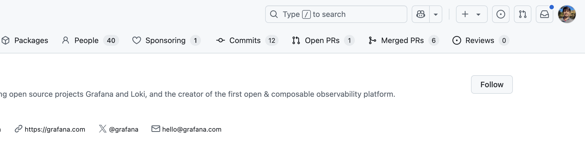

 
<h1>traceGit</h1>

a chrome extension to track contributions to github organizations

## About

A Chrome extension to track contributions to GitHub organizations.

- Shows your all commits to the organization
- Shows your all open PRs to the organization
- Shows your all merged PRs to the organization
- Shows your all code reviews to the organization

## Architecture

The extension is built with a modular architecture:

#### Core Components

- `content_script.js` - Main content script for GitHub page detection and widget injection
- `background.js` - Service worker for extension lifecycle management
- `popup.js` - Popup interface for configuration
- `utils/githubApi.js` - GitHub API integration

#### Utility Modules

- `utils/constants.js` - Shared constants and configuration
- `utils/storageHelper.js` - Chrome storage abstraction
- `utils/widgetRenderer.js` - Widget HTML generation
- `utils/domHelper.js` - DOM manipulation utilities

#### Styling

- `styles.css` - Widget styles with dark mode support
- `popup.html` - Popup interface with centered layout

## License

[MIT](https://github.com/iamrajiv/helloworld-grpc-gateway/blob/main/LICENSE)
